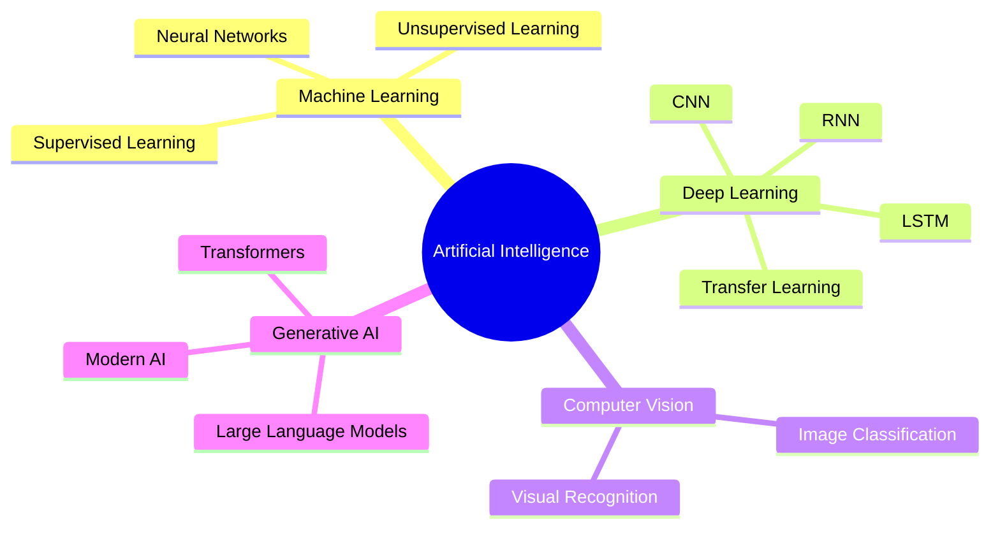

<!-- ============================================================
     HAMED BEHROOZI | GITHUB PROFILE README
     ============================================================ -->

<div align="center">


</div>

<div align="center">

### 👋 Welcome to my AI & Machine Learning journey


<br/><br/>

<a href="https://github.com/hamed-2004">
  
</a>


</div>

---

# 🧠 About Me

```python
class AIEngineer:

    def __init__(self):

        self.name = "Hamed Behroozi"

        self.focus = [
            "Artificial Intelligence",
            "Machine Learning",
            "Deep Learning",
            "Computer Vision",
            "Large Language Models"
        ]

        self.current_exploration = [
            "Generative AI",
            "LLMs",
            "Modern Neural Architectures"
        ]

        self.goal = """
        Build intelligent systems that
        transform complex data into
        meaningful solutions.
        """

    def mission(self):
        return "Learn • Build • Experiment • Improve 🚀"


hamed = AIEngineer()

print(hamed.mission())
```

I am passionate about **Artificial Intelligence and intelligent systems**, with a strong interest in transforming theoretical concepts into practical projects.

My journey currently spans multiple areas of modern AI, including:

> 🤖 **Artificial Intelligence**
> 🧠 **Machine Learning**
> ⚡ **Deep Learning**
> 👁️ **Computer Vision**
> 🗣️ **Large Language Models (LLMs)**
> ✨ **Generative AI**
> 🧩 **Neural Networks & Intelligent Systems**

I enjoy experimenting with models, comparing architectures, analyzing results, and continuously expanding my understanding of modern AI technologies.

---

# 🚀 Featured Projects

<div align="center">

### A selection of my Artificial Intelligence & Machine Learning projects

</div>

<table> <tr>

<td width="50%" valign="top">

### 🚗 Distracted Driver Detection

<a href="https://github.com/hamed-2004/MachineLearning-2026-Project-DistractedDriver">


</a>

Deep learning-based driver behavior recognition using transfer learning and image classification.

**Key Technologies**

`MobileNetV2` · `ResNet50` · `TensorFlow` · `Computer Vision`

</td>

<td width="50%" valign="top">

### 🚦 Traffic Sign Recognition

<a href="https://github.com/hamed-2004/AI-2026-Project-GTSRB">


</a>

Traffic sign classification project with neural network architecture comparison.

**Key Technologies**

`CNN` · `MLP` · `TensorFlow` · `Image Classification`

</td>

</tr>

<tr>

<td width="50%" valign="top">

### 🏥 Insurance Prediction

<a href="https://github.com/hamed-2004/AI-2026-Project-Insurance">


</a>

An intelligent prediction project exploring machine learning and fuzzy intelligence.

**Key Technologies**

`Machine Learning` · `Python` · `ANFIS`

</td>

<td width="50%" valign="top">

### 🤖 Artificial Intelligence Coursework

<a href="https://github.com/hamed-2004/KNTU-AI-HWs">


</a>

Artificial intelligence algorithms, search strategies, and intelligent problem-solving.

**Key Technologies**

`Python` · `AI Algorithms` · `Search`

</td>

</tr>

<tr>

<td width="50%" valign="top">

### 🧠 Machine Learning Coursework

<a href="https://github.com/hamed-2004/KNTU-ML-HWs">


</a>

A collection of machine learning models, experiments, and practical implementations.

**Key Technologies**

`Python` · `Machine Learning` · `Deep Learning`

</td>

<td width="50%" valign="top">

### 🔮 What's Next?

Currently expanding into the next generation of AI systems.

**Exploring**

`LLMs` · `Generative AI` · `Transformers` · `AI Systems`

🚀 **More projects coming soon...**

</td>

</tr> </table>

---

# 🧬 AI Universe

<div align="center">



</div>

---

# ⚙️ Technology Stack

<div align="center">

### 💻 Programming & Development


<br/><br/>

### 🤖 AI & Machine Learning

   

<br/><br/>

### 🧠 Neural Networks

   

<br/><br/>

### 🔬 Frameworks & Libraries


<br/><br/>

  

</div>

---

# 🗣️ Exploring Large Language Models

<div align="center">

### My journey is expanding beyond traditional Machine Learning

</div>

I am currently exploring the rapidly evolving world of **Large Language Models and Generative AI**.

My areas of interest include:

<div align="center">

|      🧠 LLMs     | 🔄 Transformers |        💬 NLP        |
| :--------------: | :-------------: | :------------------: |
| 🤖 Generative AI |   🧩 AI Agents  | 📚 Modern AI Systems |

</div>

<br/>

> **Current mindset:** Learn the foundations → Understand the models → Build practical AI systems.

---

# 📊 GitHub Analytics

<div align="center">


<br/><br/>


</div>

---

# 📈 Contribution Activity

<div align="center">


</div>

---

# 🎯 My AI Roadmap

<div align="center">

```text
FOUNDATIONS
    │
    ├── Python
    ├── Artificial Intelligence
    └── Machine Learning
            │
            ▼
DEEP LEARNING
    │
    ├── Neural Networks
    ├── CNN
    ├── RNN / LSTM
    └── Transfer Learning
            │
            ▼
COMPUTER VISION
    │
    ├── Image Classification
    ├── Recognition Systems
    └── Deep Vision Models
            │
            ▼
GENERATIVE AI
    │
    ├── Transformers
    ├── Large Language Models
    └── Modern AI Systems
            │
            ▼
THE FUTURE 🚀
```

</div>

---

# 🔥 Current Focus

<div align="center">

| 🤖 Artificial Intelligence | 🧠 Machine Learning | ⚡ Deep Learning |
| :------------------------: | :-----------------: | :-------------: |
|     👁️ Computer Vision    |       🗣️ LLMs      | ✨ Generative AI |

</div>

<br/>

```text
🧠 Learning        → Understanding modern AI systems
🔬 Experimenting   → Testing different models and architectures
🚀 Building        → Developing practical AI projects
📈 Improving       → Continuously expanding my technical skills
```

---

# 🏆 GitHub Highlights

<div align="center">

<a href="https://github.com/hamed-2004">

</a>

</div>

---

# 🐍 Contribution Snake

<div align="center">


</div>

> ⚠️ **To activate the Snake animation**, you need to create a small GitHub Actions workflow. The README is ready for it, but the animation itself requires GitHub Actions to generate the SVG.

---

# 💭 AI Philosophy

<div align="center">

### *"Artificial Intelligence is not only about building powerful models.*

### *It's about understanding problems and designing intelligent solutions."*

<br/>

**Learn. Build. Experiment. Improve. Repeat.**

</div>

---

# 🌐 Explore My Work

<div align="center">

<a href="https://github.com/hamed-2004?tab=repositories">

</a>

<br/><br/>

⭐ **If you find something interesting, feel free to explore the repository!**

<br/>


</div>

---

<div align="center">


</div>
